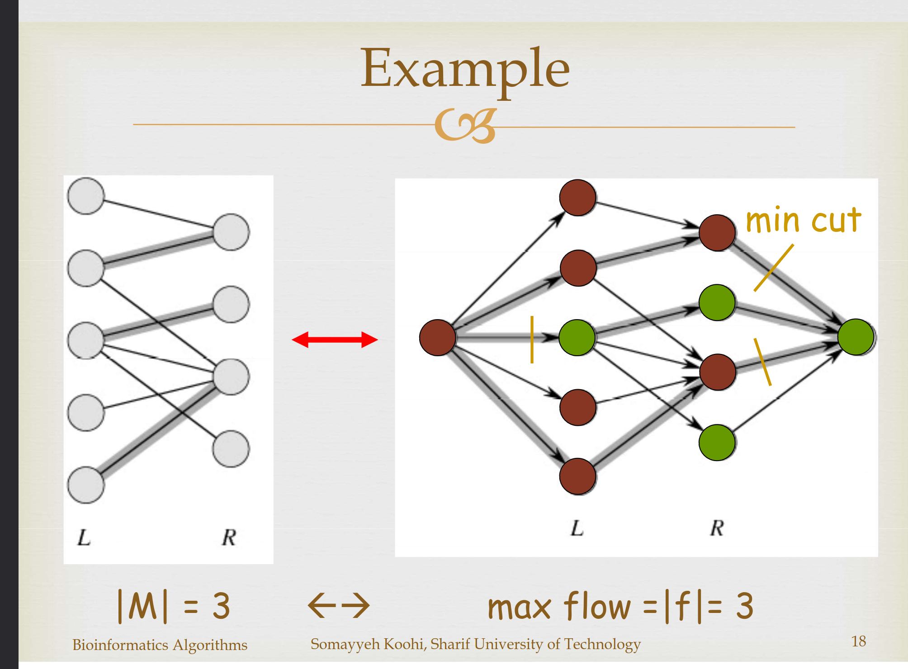

<link rel="stylesheet" href="assets/css/style.css">

  

    
    

      <h2>Firstname Lastname</h2>
      
Student @ Y University

      
Email: <a href="mailto:ddfs@gmail.com">ddfs@gmail.com</a>

      
GitHub: <a href="https://github.com/userx" target="_blank">userx</a>

      
LinkedIn: <a href="https://linkedin.com/in/user-x" target="_blank">user-x</a>

    

  

  

    <nav class="navbar">
      <a href="#bio">Bio</a>
      <a href="#education">Education</a>
      <a href="#projects">Projects</a>
      <a href="#papers">Papers</a>
      <a href="#interests">Interests</a>
    </nav>

    <section id="bio"><h2>Bio</h2>
Write about yourself here.
</section>
    <section id="education"><h2>Education</h2>
List your education details.
</section>
    <section id="projects"><h2>Projects</h2>
Showcase your projects here.
</section>
    <section id="papers"><h2>Papers</h2>
List your papers/publications.
</section>
    <section id="interests"><h2>Interests</h2>
Mention your research or personal interests.
</section>
  

